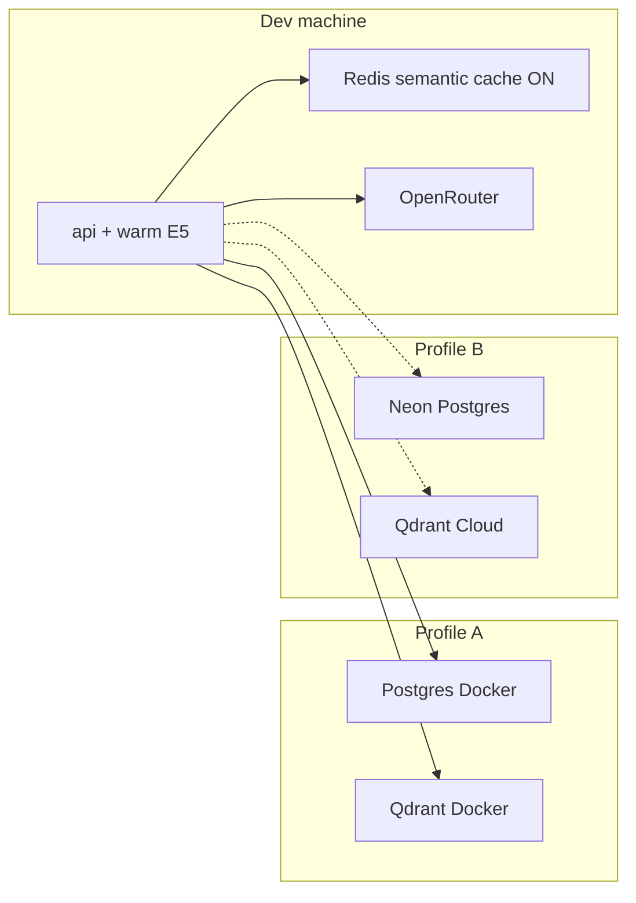

# Sprint 30 — Local vs cloud storage comparison

> Статус: `planned`
>
> Ветка: `sprint/30-cloud-storage-comparison`
>
> Связанная фаза roadmap: `Фаза 14`
>
> Backlog: `CLOUD-001`
>
> GitHub: [Issue #82](https://github.com/DaniilJechev/obsidian-rag-lab/issues/82),
> [Milestone Phase 14](https://github.com/DaniilJechev/obsidian-rag-lab/milestone/14)

## Sprint Goal

Измеримое сравнение **Profile A (local Docker storage)** vs **Profile B (Neon Postgres +
Qdrant Cloud)** на одном dev-машине: **p50/p95 latency**, cost, ops effort, cold vs warm.
Все метрики **обязательно** в MLflow (`phase-14-cloud-storage-comparison`).
Benchmark отражает **реалистичный RAG path**: semantic cache **ON**, rerank **OFF**,
embedding model **прогрет** до замеров.

## Why

Phase 13 закрыла cache и token budget на local storage. Следующий production-like
вопрос — trade-offs managed cloud для Postgres и Qdrant без переноса api/E5 в cloud.
Azure отложен (регистрация не прошла); Neon + Qdrant Cloud — default free-tier profile.

## Architecture (locked)

| Component | Profile A (local) | Profile B (cloud) |
|-----------|-------------------|-------------------|
| Postgres | Docker `postgres:16` | **Neon** (`DATABASE_URL` in `.env.cloud`) |
| Qdrant | Docker `qdrant` | **Qdrant Cloud** (URL + API key in `.env.cloud`) |
| Redis | Docker **local** | Docker **local** (same — cache not in cloud) |
| api + E5 | local Docker / host | local Docker / host (unchanged) |
| Generate | OpenRouter | OpenRouter (unchanged) |



## Benchmark protocol (locked)

Эти условия **одинаковы** для Profile A и Profile B; меняются только `DATABASE_URL`
и `QDRANT_*` (через `.env` vs `.env.cloud`).

| Parameter | Value | Notes |
|-----------|-------|-------|
| **Semantic cache** | **ON** | `cache.enabled: true` or `enable_cache=true` on requests |
| **Rerank** | **OFF** | `rerank.enabled: false`; no `--enable-rerank` |
| **Warm embedding** | **required** | E5 loaded before timed runs (see Warmup below) |
| **Retrieval method** | `hybrid` | same as Phase 7 baseline |
| **MLflow** | **mandatory** | one run per profile; experiment `phase-14-cloud-storage-comparison` |
| **Queries** | ≥ 20 | mix: unique + paraphrase/repeat for cache hits |
| **Metrics** | p50/p95 mean latency, cache_hit_rate, cold vs warm | per profile in MLflow + table in this doc |

### Warmup (before timed benchmark)

1. Start stack: `docker compose --env-file .env -f docker/compose.yml up -d postgres qdrant redis api` (Profile A) or same with `.env.cloud` overrides (Profile B).
2. Wait `GET /health` → `status: ok` and embedder ready.
3. **Warm embedding:** one non-timed `POST /search` hybrid (or ingest health path that touches E5) so model load is not in p50/p95.
4. Optional: one `POST /generate` with `enable_cache=false` to warm retrieval path (not counted in storage benchmark if using `/search` only).

### Cache-aware latency

Чтобы **средняя latency учитывала cache** (не только cold miss):

1. **Pass 1 (cache fill):** прогнать query set один раз с `enable_cache=true` — заполнить Redis.
2. **Pass 2 (measured):** тот же query set (или subset с paraphrase hits ≥ 0.92) — **эти** latencies идут в p50/p95 и MLflow.
3. Логировать `cache_hit_rate` и отдельно first-query-after-idle (Neon scale-to-zero / Qdrant suspend) как **cold-start** row в таблице.

Rerank **не** включаем — CE latency не смешиваем со storage comparison.

## Scope

- [ ] Local baseline (Profile A): warmup + two-pass benchmark → MLflow run `local-docker-storage`
- [ ] Cloud profile env: `configs/deploy/cloud-profile.example.env` + `.env.cloud` (gitignored)
- [ ] Neon Postgres: alembic migrate + smoke rows
- [ ] Qdrant Cloud: re-upsert vectors (full or documented subset)
- [ ] Cloud benchmark (Profile B): same protocol → MLflow run `neon-qdrant-cloud`
- [ ] Comparison table in this doc (latency, cost, ops, cold-start)
- [ ] MLflow experiment tags: phase=14, sprint=30, backlog=CLOUD-001

## Out of Scope

- Azure / Yandex cloud deploy (Azure registration blocked)
- Cloud Redis (Redis stays local for both profiles)
- Rerank (`enable_rerank=true`)
- Paid embeddings (Phase 15)
- Ollama / vLLM (Phase 16)
- Moving `api` container to cloud
- Session memory / multi-turn RAG

## Expected Artifacts

- `docs/agile/sprint-30-cloud-storage-comparison.md` — этот документ
- `configs/deploy/cloud-profile.example.env` — placeholders for Neon + Qdrant Cloud
- MLflow experiment **`phase-14-cloud-storage-comparison`** — runs per profile (mandatory)
- Optional: `configs/eval/cloud_storage/storage_latency_v0.yaml` + `rag-cli eval storage` (implementation sprint)

## Acceptance Criteria

- [ ] MLflow: ≥ 2 runs (`local-docker-storage`, `neon-qdrant-cloud`) with p50/p95, cache_hit_rate, profile tags
- [ ] Benchmark used cache ON + rerank OFF + warm E5 on both profiles
- [ ] Neon + Qdrant Cloud reachable; secrets only in `.env.cloud`
- [ ] Comparison table filled in this doc
- [ ] Local remains default for daily dev
- [ ] pytest + ruff green on implementation PR; vault / secrets ok

## Definition of Done

- [ ] Все задачи из Scope выполнены или явно перенесены в backlog.
- [ ] Acceptance Criteria проверены.
- [ ] MLflow runs воспроизводимы (commands in Validation Evidence).
- [ ] Read-only vault не изменён.
- [ ] Секреты не добавлены в Git.
- [ ] Результаты записаны в этот sprint-документ.
- [ ] PR merged; Issue CLOUD-001 closed; Milestone Phase 14 closed.

## Dependencies and risks

- Sprint 29 on `main`; default `max_context_tokens: 1200`
- Semantic cache default YAML still `enabled: false` — **benchmark explicitly enables cache**
- Neon cold start (scale-to-zero ~5 min idle); Qdrant Cloud suspend ~7d — report separately
- Re-upsert to Qdrant Cloud may be slow — time-box with documented subset
- Network RTT from home to Neon/Qdrant — both profiles measured from same machine

## Estimate

10–16 hours (planning + cloud signup + re-upsert + benchmark + doc).

## Proposed branch

`sprint/30-cloud-storage-comparison`

## Execution Log

| Дата | Действие / решение | Результат |
|---|---|---|
| 2026-09-02 | Planning | Issue [#82](https://github.com/DaniilJechev/obsidian-rag-lab/issues/82); Milestone [14](https://github.com/DaniilJechev/obsidian-rag-lab/milestone/14); MLflow mandatory; cache ON + rerank OFF + warm E5 locked |

## Validation Evidence

### Commands (to run during implementation)

```text
# Profile A — local storage
docker compose --env-file .env -f docker/compose.yml up -d postgres qdrant redis api
curl http://127.0.0.1:8000/health
# warmup search, then two-pass benchmark with enable_cache=true, enable_rerank=false
# MLflow run: local-docker-storage

# Profile B — cloud storage (.env.cloud: Neon DATABASE_URL + Qdrant Cloud)
# alembic upgrade head against Neon
# re-upsert vectors to Qdrant Cloud
# same warmup + two-pass benchmark
# MLflow run: neon-qdrant-cloud
```

### Test and Lint Results

- Tests: TBD (implementation sprint)
- Lint: TBD
- CI: TBD

### Metrics

| Metric | Profile A (local) | Profile B (cloud) | Context |
|---|---:|---:|---|
| search p50 ms | TBD | TBD | hybrid, cache ON, rerank OFF |
| search p95 ms | TBD | TBD | pass 2 after cache fill |
| cache_hit_rate | TBD | TBD | pass 2 |
| cold_start_ms | TBD | TBD | first query after idle |
| monthly cost USD | 0 | TBD | free tier quotas |

## Review

### Completed

- Planning doc + GitHub milestone/issue

### Not Completed

- Implementation, cloud deploy, benchmarks

### Changed Decisions

- **2026-09-02:** MLflow mandatory (not optional markdown-only).
- **2026-09-02:** Both profiles benchmark with **semantic cache ON** (realistic avg latency).
- **2026-09-02:** **Rerank OFF** for storage comparison.
- **2026-09-02:** **Warm E5** required before timed runs.
- **2026-09-02:** Azure rejected → **Neon + Qdrant Cloud**.

## Completion

- [ ] Definition of Done проверен.
- [ ] Review проведён.
- [ ] Commit/PR/merge выполнены.
- [ ] Backlog CLOUD-001 → done.

**Итоговый статус:** `planned`

**Дата завершения:** TBD
